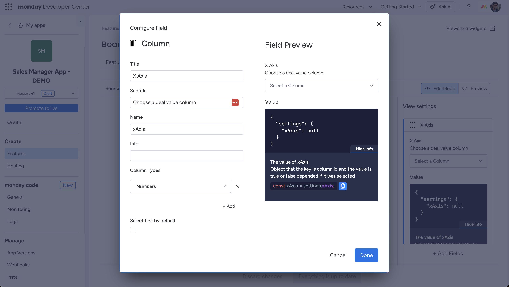

## Overview
 This is a CRM reporting app to demo the capabilities of the monday app framework & API. 

 ## Prerequisites
 - Node.js and npm installed on your machine (recommended: node v20)
 - A monday accoun ([sign up for a developer account here](https://auth.monday.com/users/sign_up_new?developer=true&utm_source=dev_documentation#soft_signup_from_step))

 ## Get started

# Add your API token: 
 ```
 npm run init
 ```
 > [Follow these instructions to copy your API token](https://developer.monday.com/api-reference/docs/authentication#accessing-api-tokens) from the monday web platform.

# Start the development server
```
npm run start
```

# Add OAuth scopes
Open the "OAuth" section in your app and add the following scopes: 
- boards:read

# Add a board view feature
Click "Features" > "Create Feature" > "Board View"

# Add settings

Add the following 3 settings fields: 

## X Axis


# Update API schema when using release candidate in API

1. Make introspection query in API playground
2. Copy result
3. Paste into `schema.json`
4. Run `npm run codegen`